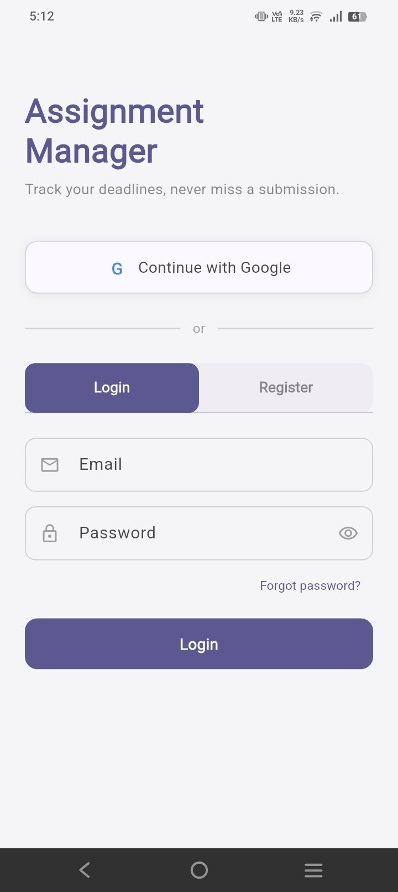
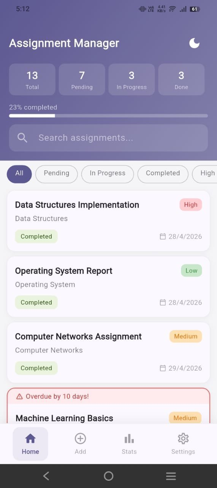
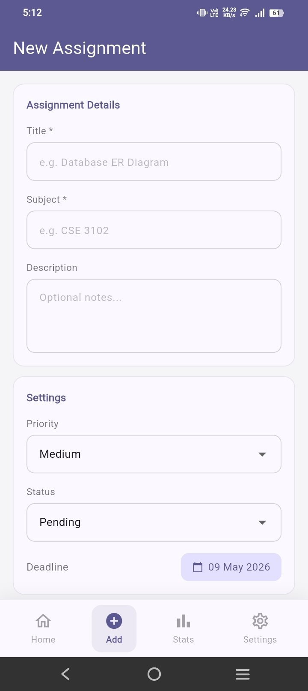
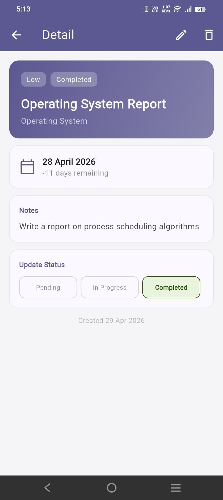
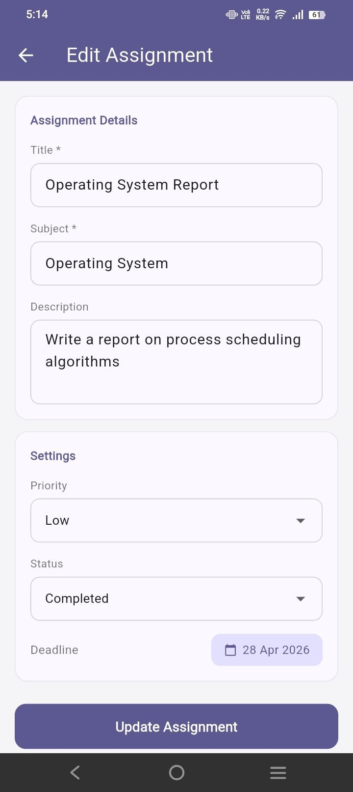
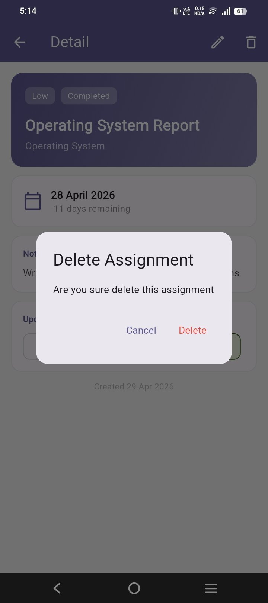
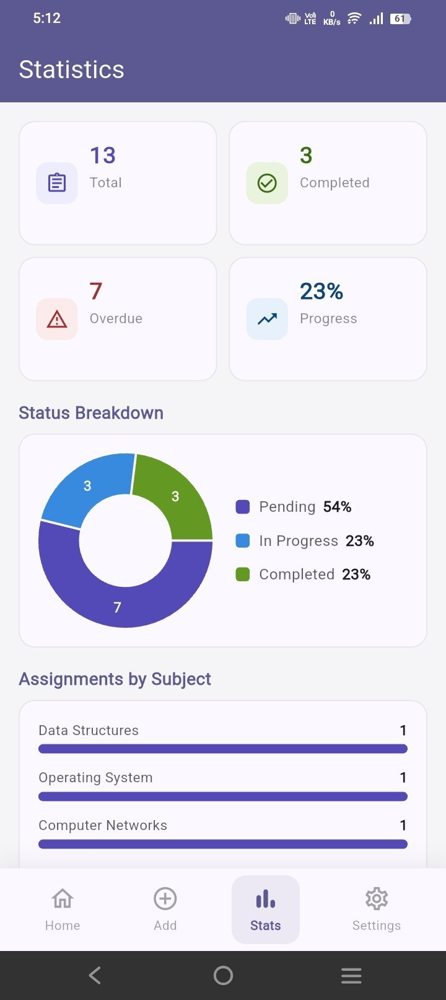
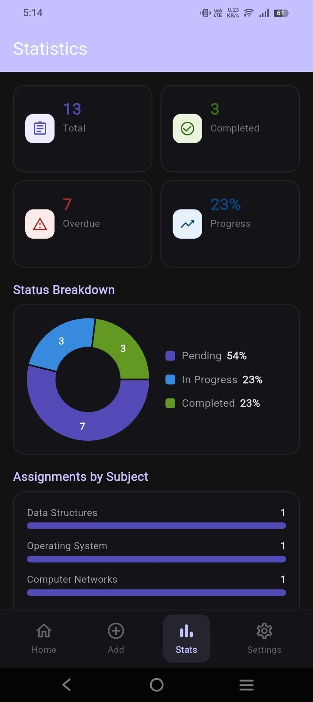
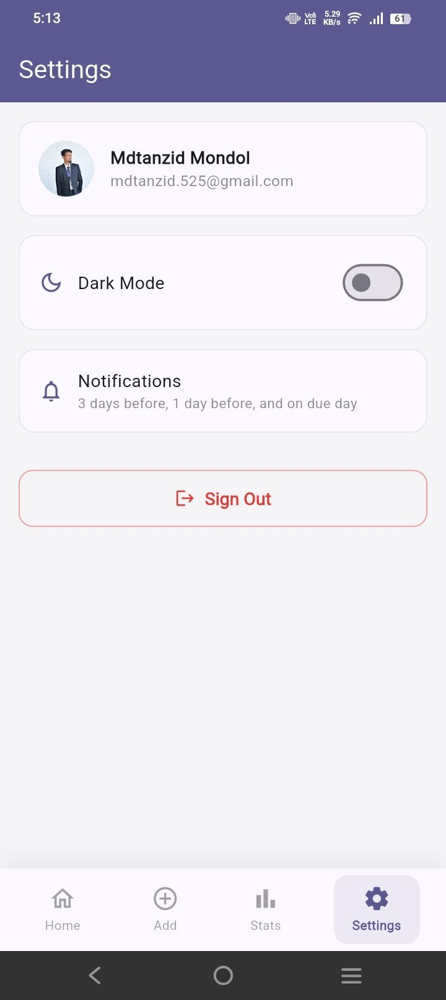

# 📱 Assignment Manager

<div align="center">


<br/><br/>

> **A smart, feature-rich assignment management app for students.**
> Built with Flutter — works on Android, iOS, and Web.

<br/>

[✨ Features](#-features) • [📱 Screenshots](#-screenshots) • [🛠 Tech Stack](#-tech-stack) • [🚀 Getting Started](#-getting-started) • [📄 Documentation](#-documentation) • [👨‍💻 Author](#-author)

</div>

---

## 🎯 Overview

**Assignment Manager** helps students stay on top of their academic workload. From deadline tracking to push notifications, dark mode, and Firebase cloud sync — everything a student needs, in one app.

---

## 📱 Screenshots

### 🔐 1. Login
<div align="center">

<br/><br/>
<em>Google Sign-In + Email/Password · Login · Register · Forgot password</em>
</div>

---

### 🏠 2. Home Screen
<div align="center">

<br/><br/>
<em>Stats header (Total · Pending · In Progress · Done) · Progress bar · Search · Filter chips · Assignment cards with priority & status badges · Overdue banner</em>
</div>

---

### ➕ 3. Add Assignment
<div align="center">

<br/><br/>
<em>Title · Subject · Description · Priority · Status · Deadline picker</em>
</div>

---

### 📋 4. Assignment Detail
<div align="center">

<br/><br/>
<em>Full details · Deadline countdown · Notes · Quick status update (Pending / In Progress / Completed)</em>
</div>

---

### ✏️ 5. Edit Assignment
<div align="center">

<br/><br/>
<em>Pre-filled form · Edit all fields · Update deadline</em>
</div>

---

### 🗑️ 6. Delete Confirmation
<div align="center">

<br/><br/>
<em>Confirmation dialog before permanent delete</em>
</div>

---

### 📊 7. Statistics

| Light Mode | Dark Mode |
|:---:|:---:|
|  |  |
| KPI cards · Donut chart · Subject bars | Same in dark mode |

---

### ⚙️ 8. Settings
<div align="center">

<br/><br/>
<em>User profile · Dark mode toggle · Notification schedule · Sign Out</em>
</div>

---

## ✨ Features

### 📝 Core
- ➕ Add, edit, and delete assignments
- 🔄 Track status — Pending, In Progress, Completed
- ⏰ Deadline countdown with overdue detection
- 🎯 Priority levels — High, Medium, Low

### 🔔 Smart Notifications
- ✅ Instant confirmation when assignment is saved
- 📅 Reminder 3 days before deadline at 9:00 AM
- ⚠️ Reminder the day before at 9:00 PM
- 🔴 Alert on the due day at 8:00 AM

### 📊 Dashboard & Analytics
- 📈 Live stats — Total, Pending, In Progress, Done
- 🟣 Progress bar showing completion percentage
- 🍩 Statistics screen with donut chart, subject bar chart, and priority breakdown
- 📆 Upcoming deadlines list

### 🔍 Search & Filter
- 🔎 Real-time search by title or subject
- 🗂️ Filter by All, Pending, In Progress, Completed, High Priority

### 🎨 User Experience
- 💫 Animated splash screen
- 🧭 Bottom navigation bar — Home, Add, Stats, Settings
- 🌙 Dark mode toggle (persisted across sessions)
- 🔀 Smooth fade transitions between screens
- ✅ Form auto-resets and redirects to Home after saving

### ☁️ Backend & Auth
- 🔐 Firebase Authentication — Email/Password + Google Sign-In
- 🔥 Firebase Firestore — real-time cloud sync across devices
- 💾 Dark mode preference saved locally via `shared_preferences`
- 🔑 Password reset via email

---

## 🛠 Tech Stack

| Layer | Technology |
|-------|-----------|
| 📱 Framework | Flutter 3.19 / Dart 3.3 |
| 🧠 State Management | Provider |
| 💾 Local Storage | shared_preferences |
| 🔥 Cloud Database | Firebase Firestore |
| 🔐 Authentication | Firebase Auth |
| 🔔 Notifications | flutter_local_notifications + timezone |
| 📊 Charts | fl_chart |
| 📅 Date Formatting | intl |
| 🎨 Design System | Material Design 3 |

---

## 🚀 Getting Started

### ✅ Prerequisites

```
Flutter SDK 3.0.0+
Dart SDK 3.0.0+
Android Studio or VS Code
Android SDK API Level 21+
Firebase project configured
```

### ⚡ Installation

```bash
# 1️⃣ Clone the repository
git clone https://github.com/tanzid-48/assignment_manager.git

# 2️⃣ Navigate to project directory
cd assignment_manager

# 3️⃣ Install dependencies
flutter pub get

# 4️⃣ Run on Android
flutter run -d android

# 5️⃣ Run on Chrome
flutter run -d chrome

# 📦 Build release APK
flutter build apk --release
```

> **Firebase setup required** — see [📄 Full Documentation](docs/assignment_manager.pdf)
 for step-by-step Firebase configuration guide.

---

## 📂 Project Structure

```
lib/
├── 🚀 main.dart                        # App entry point, Firebase init, auth wrapper
│
├── 📦 models/
│   └── assignment.dart                 # Assignment data model + copyWith
│
├── 🧠 providers/
│   └── assignment_provider.dart        # State management, Firestore CRUD, tab switching
│
├── ⚙️ services/
│   ├── notification_service.dart       # Local + scheduled notifications
│   └── auth_service.dart              # Firebase Auth logic
│
└── 🖥️ screens/
    ├── splash_screen.dart              # Animated intro screen
    ├── auth_screen.dart               # Login / Register screen
    ├── home_screen.dart               # Bottom nav + Home tab
    ├── add_assignment_screen.dart      # Add / Edit form
    ├── detail_screen.dart             # Assignment detail + quick status update
    ├── statistics_screen.dart         # Charts and analytics
    └── settings_screen.dart           # Dark mode, user info, sign out
```

---

## 🔔 Notification Schedule

| ⏱️ Trigger | 🕐 Time | 💬 Message |
|-----------|---------|-----------|
| Assignment saved | Immediately | ✅ Assignment Saved! |
| 3 days before deadline | 9:00 AM | 📅 3 Days Left! |
| 1 day before deadline | 9:00 PM | ⚠️ Deadline Tomorrow! |
| On deadline day | 8:00 AM | 🔴 Due Today! |

---

## 📄 Documentation

Full project documentation including architecture diagrams, Firestore API reference, data models, Firebase setup guide, and implementation decisions:

👉 **[📥 Download Full Documentation (PDF)](docs/assignment_manager.pdf)**

---

## 🗺️ Planned Features

- [ ] 📄 PDF export
- [ ] 🔲 Home screen widget
- [ ] ☁️ Google Drive backup
- [ ] 🌐 Bangla language support
- [ ] 🎤 Voice input
- [ ] 👥 Share assignments with classmates
- [ ] 🚀 Play Store release

---

## 👨‍💻 Author

<div align="center">

### Md. Tanzid Mondol

🎓 **Student · Flutter Developer**

🏫 Pundra University of Science & Technology

| | |
|--|--|
| 📚 Course | CSE 3102 — Mobile Application Development |
| 🆔 Student ID | 0322320105101048 |
| 📖 Semester | 6th Semester |
| 👨‍🏫 Instructor | Md. Forhan Shahriar Fahim |

📧 mdtanzid.525@gmail.com
🐙 [@tanzid-48](https://github.com/tanzid-48)

</div>

---

## 📝 License

MIT License — © 2026 Md.Tanzid Mondol

---

<div align="center">

💙 Made with Flutter · 🏫 Pundra University of Science & Technology · 📅 2026

</div>